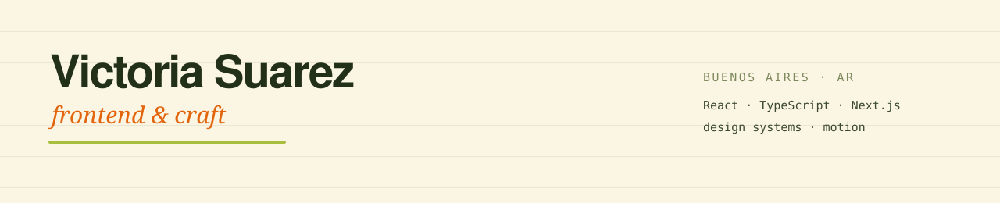

<p align="center">
  
</p>

I write code the way I used to draw: **layer by layer**.

I spent six years illustrating and tattooing, then somehow ended up spending the next seven building web apps instead — for a US retail platform, a bank, and a consultancy.

```txt
React · TypeScript · Next.js · Storybook · Figma · design systems
```

Occasionally supervised by **Renton** (naps through code review, sits in front of the monitor when he disagrees) and **Zeldita** (QA, mostly through unplanned keyboard input).

Pinned repos are the things I actually want you to see.

Everything else is me trying things, breaking things, fixing them, and learning in public.
