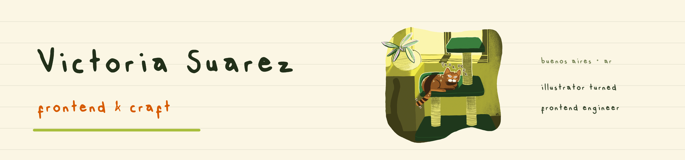
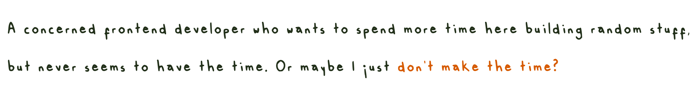
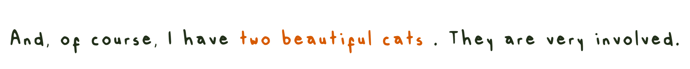

<!-- Every line of type here is my own handwriting, rendered from Vic-Regular.otf -->
<!-- Source images: assets/readme/*.png  (light + -dark pairs, swapped via prefers-color-scheme) -->

  

<picture>
  <source media="(prefers-color-scheme: dark)" srcset="assets/readme/heading-dark.png">
  
</picture>

<picture>
  <source media="(prefers-color-scheme: dark)" srcset="assets/readme/p1-dark.png">
  
</picture>

<picture>
  <source media="(prefers-color-scheme: dark)" srcset="assets/readme/p2-dark.png">
  
</picture>

<picture>
  <source media="(prefers-color-scheme: dark)" srcset="assets/readme/p3-dark.png">
  
</picture>

<picture>
  <source media="(prefers-color-scheme: dark)" srcset="assets/readme/links-dark.png">
  
</picture>

[LinkedIn](https://www.linkedin.com/in/victoria-suarez1997/)
